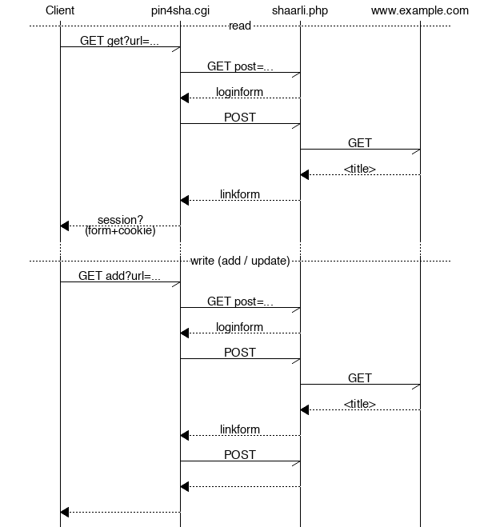

# pinboard4shaarli.cgi

The natural API for shaarli.

## Why?

The wish to have an API goes back to the [early days](https://sebsauvage.net/wiki/doku.php?id=php:shaarli:ideas).

And because shaarli started as a personal, minimal delicious clone, using a minimal subset of just
the delicious API, seems natural to me. [pinboard](https://pinboard.in/api/) prooves the API
is not only seasoned and mature, but also still up the job today.

Also I need a drop-in API compatibility layer for a wide range of shaarli versions out there being
fed to by [ShaarliOS](https://code.mro.name/mro/ShaarliOS/).

## How?

You find a single, statically linked, zero-dependencies ([Go](https://golang.org/)) binary which is both a

1. cgi to drop into your shaarli php webapplication next to index.php – as the API endpoint,
2. commandline client to any shaarli out there, mostly for debugging purposes.

## Compatibility

All shaarlis from the old ages until at least spring 2019 (v0.10.3).

All systems [Go](https://golang.org/) can produce binaries for.

Just the delicious API calls in [openapi.yaml](openapi.yaml)

The API server code (delicious implementation) is the same as in [ShaarliGo](https://code.mro.name/mro/ShaarliGo).

## Design Goals

| Quality         | very good | good | normal | irrelevant |
|-----------------|:---------:|:----:|:------:|:----------:|
| Functionality   |           |      |    ×   |            |
| Reliability     |     ×     |      |        |            |
| Usability       |           |   ×  |        |            |
| Efficiency      |           |      |    ×   |            |
| Changeability   |           |   ×  |        |            |
| Portability     |     ×     |      |        |            |

